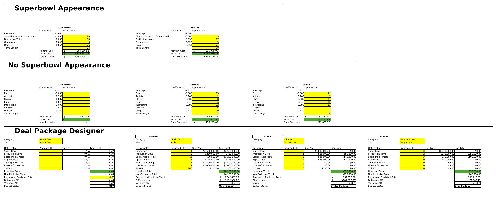

# AB Celebrity Talent Fair Market Value Model

A regression-based pricing framework for celebrity endorsement deals, delivered as a self-contained Excel workbook with two negotiation-ready tools: a fair market value calculator and a deal package budget checker.

*Excel files don't preview on GitHub, so this screenshot of the live calculator sheet is included for anyone browsing the repo without downloading it.*

## Overview

Anheuser-Busch's celebrity endorsement deals range from under $100K to over $5M with no standardized way to price them, negotiations rely on subjective judgment rather than data. The dataset provided (40 celebrities, celebrity attributes plus roughly 70 E-Poll market research metrics) had no recorded deal prices, so the model first needed a reliable proxy for deal value before it could be trained.

- **Composite Score and tiering.** Each celebrity is scored as `0.5 x Total Awareness + 0.3 x Endorsement Score + 0.2 x Fan Score` and assigned to A-List (>=45), Supporting (25-44), or B-List (<25). On the 34 usable celebrities (6 were dropped for missing data), this produced 6 A-List, 9 Supporting, and 19 B-List.
- **Target variable construction.** With no real deal prices to train on, a unit price table (segmented by tier and category, sourced from industry reports and AI-assisted estimates where data was thin, validated against Anheuser-Busch's own Super Bowl benchmarks) was used to impute each celebrity's historical deal value: quantity x unit price per deliverable, summed and normalized by contract term in months.
- **Two regressions, split by Super Bowl inclusion.** Python (Google Colab) ran forward stepwise OLS to select significant predictors (p < 0.1); the final models were then fit in Excel. Celebrities with a Super Bowl deliverable are priced on reach and persona traits (Shared, Posted or Commented, Distinct Voice, Glamorous, Unique; adjusted R² 0.90); celebrities without one are priced on audience loyalty and personality traits (Fan, Activist, Classy, Funny, Interesting, Sincere, Unique; R² 0.98, adjusted R² 0.96).

## Key Findings

- **The two-model split matters.** Reach and glamour drive Super Bowl-caliber pricing, while everyday-deal pricing is driven more by audience loyalty and authenticity. Using one model for both would blend two different pricing logics.
- **Tested against 3 held-out celebrities, the model mostly agreed with the proposed deal packages, and flagged where it didn't.** An A-List Music Artist's proposed package (Super Bowl, tour sponsorship, live performance) came in 35% over the model's predicted value, suggesting room to negotiate down. A Supporting-tier Athlete's package was 33% under the model's prediction, suggesting the celebrity is underutilized. A Supporting-tier Entertainer landed within a reasonable 25% range.
- **The workbook is a working tool, not just an analysis.** Sheet 4 lets an analyst enter a celebrity's E-Poll scores to get a predicted price in under a minute, or build out a specific deliverable package and see instantly whether it falls over or under the model's prediction.

## Limitations

1. The target variable is an estimate, not an actual price. It's built from imputed unit costs, external benchmarks, and AI-assisted estimates for gaps in the pricing research, not real historical deal records, since none were available. Retraining on real deal prices, if the company logs them going forward, would materially improve accuracy.
2. The training set is small (34 celebrities), which limits precision, especially for tier/category combinations with few examples.
3. Unit prices are static, reflecting available research at the time the model was built, they'd need periodic updates to track a moving market.

## Tech Stack

Excel (regression modeling, live calculator tools) · Python (pandas, statsmodels, Google Colab) for stepwise feature selection · E-Poll market research data

## Repository Contents

- `ab_celebrity_talent_pricing_model.xlsx`: cleaned dataset, both regression models, and the two-tool calculator (fair market value calculator and deal package designer)
- `README.md`: this file
- `calculator_screenshot.png`: screenshot of the live calculator sheet
## Team

Group project with Logan Dudley, Ankit Padakal, and Gabriel Wang.
